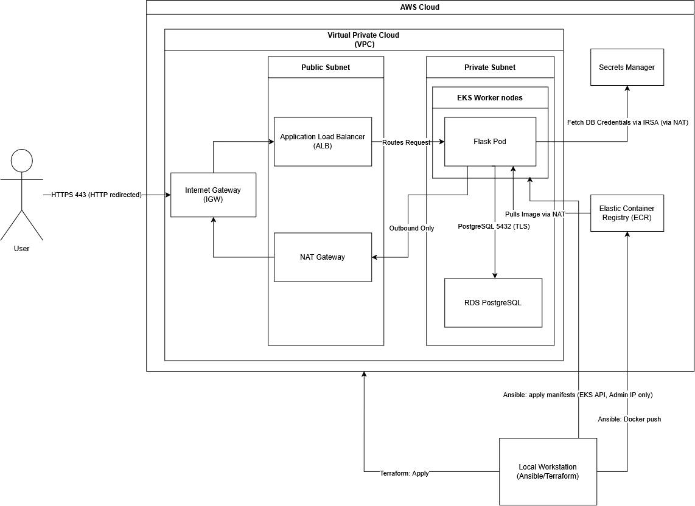

# DevSecOps Contact Form

A two-tier contact form (name, email, message) running on **AWS**.
A Flask webapp deployed on **EKS behind an Application Load Balancer**, storing submitted forms in an **RDS PostgreSQL instance**, with the database password stored in **Secrets Manager**.

Everything is deployed from a local workstation, 
* **Terraform** provisions the infrastructure.
* **Ansible** builds and deploys the application. 
* The environment is hardened using security controls. 
* **AWS Security Hub** checks it against *AWS Foundational Security Best Practices (FSBP)* and the *CIS AWS Foundations Benchmark v5.0.0*.

- Security controls and how to verify each one: [`docs/security-hardening.md`](docs/security-hardening.md)
- Security Hub results, remediation and exceptions: [`docs/security-hub.md`](docs/security-hub.md)

## Architecture



**How a request flows**
1. The browser connects to `https://contact.<domain>`. The ALB presents an ACM certificate and decrypts the traffic.
2. The ALB forwards the request to one of the two app pods, straight to the pod's IP address (`target-type: ip`).
3. For each submission, the app uses its IAM role (IRSA) to fetch the database password from Secrets Manager. The request leaves the VPC through the NAT Gateway.
4. The app writes the submission to RDS over TLS, using a parameterized query.

**Where things live**

| Layer                | Where           | Why                                                               |
| -------------------- | --------------- | ----------------------------------------------------------------- |
| ALB, NAT Gateway     | Public subnets  | The only resources that need a public address                     |
| EKS nodes, pods, RDS | Private subnets | No inbound route from the internet; outbound only through the NAT |

## Repository layout

| Path                  | What it is                                                                                     |
| --------------------- | ---------------------------------------------------------------------------------------------- |
| `app/`                | Flask app, Dockerfile (non-root user), `init.sql` schema, `show_submissions.py`                |
| `terraform/`          | All infrastructure, one stack (network, EKS, RDS, ECR, IAM/IRSA, ACM, security services)       |
| `terraform/policies/` | The AWS Load Balancer Controller's published IAM policy (v2.14.1)                              |
| `k8s/`                | Kubernetes manifests as **Jinja2 templates**; account-specific values are filled in by Ansible |
| `ansible/deploy.yaml` | Build, push and deploy playbook                                                                |
| `docker-compose.yml`  | Local development (app + Postgres)                                                             |
| `docs/`               | Security documentation                                                                         |
* *Local dev: Create a .env with DB_NAME, DB_USER, DB_PASSWORD*

## Prerequisites

| Tool | Used for |
|---|---|
| AWS CLI v2 with a profile for the target account | Authentication for Terraform, kubectl and Ansible |
| Terraform ≥ 1.5 | Infrastructure |
| kubectl | Cluster access |
| Docker | Building the image |
| Ansible (with the `kubernetes` Python library: `pipx inject ansible kubernetes`) | Deployment. On Windows, run it in WSL. |
| A domain you control | The HTTPS certificate and the app's address |

Create `terraform/terraform.tfvars` (gitignored):

```hcl
admin_cidr = "<your public IP>/32"   # who may reach the EKS API https://checkip.amazonaws.com
app_domain = "contact.<your-domain>" # name on the HTTPS certificate
```
## Deploy

Terraform can run in any shell. Ansible needs Linux, so on Windows run the
**"Deploy the app"** steps in WSL. Each environment keeps its own Terraform
providers and kubeconfig, so those steps are repeated there.

### Provision the infrastructure

```bash
# 0. Use the project's AWS profile (cmd: set AWS_PROFILE=devsecops)
export AWS_PROFILE=devsecops
aws sts get-caller-identity              # should show the expected IAM user

# 1. Infrastructure (~20 minutes, mostly EKS)
terraform -chdir=terraform init
terraform -chdir=terraform plan -out=deploy.tfplan
terraform -chdir=terraform apply deploy.tfplan

# 2. First time only: prove domain ownership for the certificate.
#    Add the CNAME from this output at your DNS provider, then wait for ISSUED.
terraform -chdir=terraform output acm_validation_record
```

### Deploy the app (in the shell where Ansible runs, e.g. WSL)

```bash
# 3. Check Docker is reachable (on Windows: start Docker Desktop and enable
#    Settings → Resources → WSL integration for your distro)
docker info > /dev/null && echo "Docker OK"

# 4. Point kubectl at the new cluster (this shell has its own kubeconfig)
aws eks update-kubeconfig --name dso-eks --region ap-southeast-1
kubectl get nodes                        # expect 2 nodes Ready

# 5. Install this OS's Terraform providers, so Ansible can read the outputs
terraform -chdir=terraform init

# 6. Build, push and deploy (commit first: the image tag is the commit hash)
ansible-playbook ansible/deploy.yaml
```

7. At your DNS provider, point `contact.<domain>` (CNAME) at the ALB address the playbook prints last.

### What the playbook does

1. Reads the Terraform outputs (RDS endpoint, secret ARN, IAM role ARN, ECR URL, certificate ARN) and the git commit hash.
2. Builds and pushes the image **only if that tag isn't already in ECR**. The build uses `--provenance=false`, so ECR basic scanning can scan the image.
3. Fills in the `k8s/` templates in memory and applies them in order: namespace → service account → ConfigMap → schema Job (**waits for it to complete**) → Deployment (**waits for the pods to be ready**) → Service → Ingress.
4. Waits for the Load Balancer Controller to create the ALB, then prints its address.

Running it again with no code change reports `skipped=3` (login, build, push) and only the schema Job as `changed`. The schema step re-runs on purpose, and it's safe because `init.sql` uses `CREATE TABLE IF NOT EXISTS`.

---

## Verify

```bash
# The site answers over HTTPS; plain HTTP redirects
curl -I http://contact.<domain>          # 301 → https://
# Open https://contact.<domain> and submit the form

# The submission is in RDS (queried from inside a pod; RDS isn't reachable from outside)
kubectl exec deploy/contact-form -n contact-form -- python show_submissions.py

# Everything running in the app's namespace
kubectl get all,ingress -n contact-form
```

Every security control has its own verification command in [`docs/security-hardening.md`](docs/security-hardening.md).

---

## Teardown

```bash
# 1. Delete the Ingress first: the controller removes the ALB, which Terraform doesn't know about
kubectl delete ingress contact-form -n contact-form
aws elbv2 describe-load-balancers --query "LoadBalancers[].LoadBalancerName"   # wait for []

# 2. Destroy everything Terraform created
terraform -chdir=terraform destroy
```

If a later `apply` fails with `ResourceAlreadyExistsException` for `/aws/eks/dso-eks/cluster`, EKS recreated its log group during the destroy. Delete it with `aws logs delete-log-group --log-group-name /aws/eks/dso-eks/cluster` and apply again.

---

## Design decisions and trade-offs

| Decision                                                                                               | Gain                                                                                                                 | Cost / alternative                                                                                                             |
| ------------------------------------------------------------------------------------------------------ | -------------------------------------------------------------------------------------------------------------------- | ------------------------------------------------------------------------------------------------------------------------------ |
| **EKS via the community module** `terraform-aws-modules/eks/aws`, pinned to an exact version (21.26.0) | Well-tested defaults (IMDSv2, KMS secrets encryption, access entries) in far less code                               | Less visibility into every resource; the version is pinned because modules aren't locked like providers                        |
| **One NAT Gateway**                                                                                    | Half the cost of one per AZ                                                                                          | If its AZ fails, private subnets lose outbound access                                                                          |
| **Secrets delivery: boto3 + IRSA**                                                                     | The password is never in a manifest, a Kubernetes Secret or the repo; the pod's IAM role can read exactly one secret | The app depends on the AWS SDK; alternatives are the Secrets Store CSI driver or External Secrets Operator (more moving parts) |
| **RDS-managed master password** (`manage_master_user_password`)                                        | RDS generates and stores the password; Terraform never sees it                                                       | The app uses the master user; a dedicated least-privilege DB user would be the next step                                       |
| **TLS ends at the ALB**                                                                                | One certificate, managed by ACM                                                                                      | ALB → pod traffic is plain HTTP inside the private VPC                                                                         |
| **Target type `ip`**                                                                                   | The ALB sends traffic straight to pod IPs; no extra node hop                                                         | Relies on the VPC CNI giving pods VPC addresses (it does, by default)                                                          |
| **Immutable ECR tags = git commit hash**                                                               | Each image maps to exactly one commit; tags can't be overwritten                                                     | Every commit needs a new build; old images are expired by a lifecycle policy (keep 10)                                         |
| **Ansible `kubernetes.core.k8s` module** instead of `kubectl apply`                                    | Real `ok` / `changed` reporting, so idempotency is visible                                                           | Needs the `kubernetes` Python library                                                                                          |
| **Account-wide security settings in the app's stack**                                                  | One `apply` builds everything; one `destroy` removes everything                                                      | In a real organisation these would live in a separate, long-lived baseline stack                                               |
| **DNS at an external provider**                                                                        | Uses an existing domain                                                                                              | Two records are added by hand: the certificate validation CNAME (once) and the app CNAME (after each fresh ALB)                |

## Known limitations

- **Local Terraform state.** No remote backend or state locking; fine for one person, not for a team.
- **Deploying uncommitted code** would tag an image with a commit that doesn't contain the changes. The rule is to commit first; a `git status` guard task would be the next improvement.
- **The base image has 2 HIGH CVEs** (perl, zlib) reported by the ECR scan. Rebuild on a patched `python:3.12-slim` when one is available (see [`docs/security-hardening.md`](docs/security-hardening.md)).
