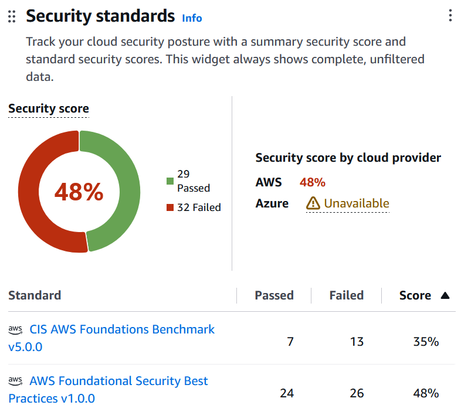
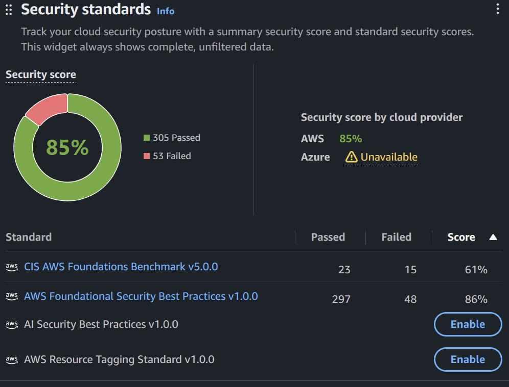

# Security Hub, Findings & Remediation
## What's enabled, and why

| Service                                                    | Role                                                                                                                                                                                            | Where                                                                                                          |
| ---------------------------------------------------------- | ----------------------------------------------------------------------------------------------------------------------------------------------------------------------------------------------- | -------------------------------------------------------------------------------------------------------------- |
| **AWS Security Hub CSPM**                                  | Runs automated checks ("controls") against the account and reports pass/fail findings                                                                                                           | `security.tf` (`aws_securityhub_account`)                                                                      |
| **AWS Foundational Security Best Practices (FSBP) v1.0.0** | AWS's own baseline, covering most services in use (EC2, EKS, RDS, ELB, ECR, IAM, S3)                                                                                                            | `aws_securityhub_standards_subscription.fsbp`                                                                  |
| **CIS AWS Foundations Benchmark v5.0.0**                   | Industry benchmark focused on account-level controls (IAM, logging, networking)                                                                                                                 | `aws_securityhub_standards_subscription.cis`                                                                   |
| **AWS Config**                                             | Records every resource's configuration. Security Hub evaluates those records, so Config is required.                                                                                            | Recorder (all supported resource types, including global ones like IAM), delivery channel, service-linked role |
| **S3 log bucket**                                          | Stores Config history (and CloudTrail logs). Private (all public-access blocks on), HTTPS-only (`DenyInsecureTransport`), writable only by the Config and CloudTrail services for this account. | `aws_s3_bucket.config` + bucket policy                                                                         |

**Why the default standards are turned off** (`enable_default_standards = false`): the default set is FSBP plus **CIS v1.2.0**, an old version. Turning the defaults off and subscribing explicitly gives FSBP + **CIS v5.0.0**, with no duplicate CIS findings.

**When checks run**
- **Change-triggered checks** run when Config records a change to a resource, usually within minutes.
- **Periodic checks** run every 12 or 24 hours. Most account-level controls work this way.
- **After enabling Security Hub**, the first results arrive within about 25 minutes, and all of them within about 2 hours.
## Results

| Snapshot | Overall | FSBP | CIS v5.0.0 |
|---|---|---|---|
| **Initial**: 27 Sep, ~2 h after enabling | 29 passed / 32 failed (**48%**) | 24 / 26 | 7 / 13 |
| **After remediation and full evaluation**: 28 Sep | 305 passed / 53 failed (**85%**) | 297 / 48 | 23 / 15 |



*Standards overlap, so the overall row counts each control once and is less than the two standards added together.*

> The initial snapshot was taken while evaluation was still in progress, so it covers only the ~60 controls that had finished at that point. The later snapshot covers all of them. That's why the *failed* count rose as well: those are newly evaluated controls.

**Reproduce the list of failed controls** (bash / WSL):

```bash
aws securityhub get-findings \
  --filters '{"ComplianceStatus":[{"Value":"FAILED","Comparison":"EQUALS"}],"RecordState":[{"Value":"ACTIVE","Comparison":"EQUALS"}]}' \
  --query 'Findings[].[Compliance.SecurityControlId,Severity.Label,Title]' \
  --output text | sort | uniq -c | sort -rn
```

Some findings refer to resources outside this project: the region's **default VPC**, and resources from earlier builds that Security Hub hasn't archived yet. Other resources in the same AWS account are out of scope.
## Remediated

All fixes are in Terraform, so they're applied on every rebuild.

| Control(s)                 | Severity    | Finding                                         | Remediation                                                                                                      | Status |
| -------------------------- | ----------- | ----------------------------------------------- | ---------------------------------------------------------------------------------------------------------------- | ------ |
| EC2.2                      | HIGH        | The VPC's default security group allows traffic | `aws_default_security_group` adopts it with **no rules**                                                         | PASSED |
| EC2.7                      | MEDIUM      | EBS volumes not encrypted by default            | `aws_ebs_encryption_by_default`. EC2.3 passes once the nodes are replaced (next rebuild).                        | PASSED |
| EC2.3                      | MEDIUM      | Attached EBS volumes not encrypted            | Pending (Passes when nodes are recreated) Rebuild                                                                                     | TBC    |
| EC2.182                    | HIGH        | EBS snapshots could be shared publicly          | `aws_ebs_snapshot_block_public_access` = `block-all-sharing`                                                     | PASSED |
| SSM.7                      | CRITICAL    | SSM documents could be shared publicly          | `aws_ssm_service_setting` disabling public sharing                                                               | PASSED |
| IAM.7, IAM.15, IAM.16      | MEDIUM/LOW  | Weak or missing account password policy         | `aws_iam_account_password_policy`: 14+ characters, all character types, 24 remembered                            | PASSED |
| IAM.28                     | HIGH        | No IAM Access Analyzer                          | `aws_accessanalyzer_analyzer` (account scope)                                                                    | PASSED |
| GuardDuty.1                | HIGH        | GuardDuty not enabled                           | `aws_guardduty_detector`                                                                                         | PASSED |
| CloudTrail.1, CloudTrail.4 | HIGH/MEDIUM | No multi-region trail; no log integrity check   | `aws_cloudtrail`: multi-region, global service events, **log file validation**, stored in the private log bucket | PASSED |
| RDS.11                     | MEDIUM      | Automatic backups under 7 days                  | `backup_retention_period = 7`                                                                                    | PASSED |
| RDS.17                     | LOW         | Tags not copied to snapshots                    | `copy_tags_to_snapshot = true`                                                                                   | PASSED |
| RDS.9, RDS.36              | MEDIUM      | Database logs not in CloudWatch                 | `enabled_cloudwatch_logs_exports = ["postgresql", "upgrade"]`                                                    | PASSED |
| ECR.3                      | MEDIUM      | No image lifecycle policy                       | `aws_ecr_lifecycle_policy` keeping the last 10 images                                                            | PASSED |

**Check the status of each remediated control:**

```bash
aws securityhub get-findings \
  --filters '{"ComplianceSecurityControlId":[{"Value":"EC2.2","Comparison":"EQUALS"},{"Value":"EC2.7","Comparison":"EQUALS"},{"Value":"EC2.182","Comparison":"EQUALS"},{"Value":"SSM.7","Comparison":"EQUALS"},{"Value":"IAM.7","Comparison":"EQUALS"},{"Value":"IAM.15","Comparison":"EQUALS"},{"Value":"IAM.16","Comparison":"EQUALS"},{"Value":"IAM.28","Comparison":"EQUALS"},{"Value":"GuardDuty.1","Comparison":"EQUALS"},{"Value":"RDS.9","Comparison":"EQUALS"},{"Value":"RDS.11","Comparison":"EQUALS"},{"Value":"RDS.17","Comparison":"EQUALS"},{"Value":"RDS.36","Comparison":"EQUALS"},{"Value":"ECR.3","Comparison":"EQUALS"},{"Value":"CloudTrail.1","Comparison":"EQUALS"},{"Value":"CloudTrail.4","Comparison":"EQUALS"}],"RecordState":[{"Value":"ACTIVE","Comparison":"EQUALS"}]}' \
  --query 'Findings[].[Compliance.SecurityControlId,Compliance.Status]' --output text | sort | uniq
```

---

## Exceptions (accepted, with reasons)

| Control(s)                             | Finding                                                                       | Why it's accepted                                                                                                              | Production approach                                                            |
| -------------------------------------- | ----------------------------------------------------------------------------- | ------------------------------------------------------------------------------------------------------------------------------ | ------------------------------------------------------------------------------ |
| EKS.1                                  | EKS endpoint is publicly accessible                                           | Restricted to a single admin IP (/32); private endpoint access is also on                                                      | Private endpoint only, via VPN or bastion                                      |
| EC2.10, EC2.55–58, EC2.60              | No VPC interface endpoints (EC2, ECR, Docker registry, SSM, Incident Manager) | Each interface endpoint costs about $7–10/month **per AZ**; the NAT Gateway provides outbound access instead                   | Interface endpoints for ECR, STS and Secrets Manager; free S3 gateway endpoint |
| EC2.6                                  | VPC flow logs not enabled                                                     | Deprioritised: CloudTrail covers API activity                                                                                  | Flow logs to S3 or CloudWatch                                                  |
| EC2.15, EC2.2                                 | Default VPC: subnet auto-assigns public IPs; default security group allows traffiic  | Applies to the region's unused **default VPC**, not the project VPC                                                            | Delete the default VPC                                                         |
| EC2.172                                | VPC Block Public Access not blocking IGW traffic                              | Enabling it would block the public ALB                                                                                         | N/A: the app is intentionally public                                           |
| EC2.17                                 | Instances use multiple network interfaces                                     | By design: the VPC CNI attaches extra ENIs to give pods VPC IPs                                                                | N/A                                                                            |
| RDS.5                                  | RDS not Multi-AZ                                                              | Doubles database cost; it's an availability trade-off, not a security one                                                      | Multi-AZ                                                                       |
| RDS.8, ELB.6                           | No deletion protection                                                        | Would block `terraform destroy` / Ingress teardown                                                                             | Enable deletion protection                                                     |
| RDS.6                                  | No enhanced monitoring                                                        | Not needed at this scale                                                                                                       | Enable with a monitoring role                                                  |
| RDS.10                                 | No IAM database authentication                                                | Password auth with the password in Secrets Manager, read via IRSA                                                              | IAM DB auth or a dedicated DB user                                             |
| RDS.23                                 | Default port 5432                                                             | A non-default port only hides the database; the security group is the actual control                                           | —                                                                              |
| ELB.5                                  | No ALB access logs                                                            | Needs a dedicated bucket and permissions; deprioritised                                                                        | Enable access logs to S3                                                       |
| ELB.21, ELB.22                         | Target groups use HTTP                                                        | TLS terminates at the ALB; ALB → pod traffic stays in the private VPC                                                          | End-to-end TLS                                                                 |
| SSM.1, SSM.6                           | Nodes not managed by Systems Manager; no SSM Automation logging               | No shell access to nodes is needed, and enabling SSM would add an access path; SSM Automation isn't used                       | Session Manager instead of SSH if node access is needed                        |
| AutoScaling.6                          | Node group uses one instance type                                             | Cost and simplicity; already spread across 2 AZs                                                                               | Several instance types                                                         |
| CloudTrail.2, CloudTrail.5             | Trail not encrypted with KMS; not sent to CloudWatch Logs                     | Logs are encrypted by S3 default encryption and protected by digest validation                                                 | Customer-managed KMS key; CloudWatch integration with metric alarms            |
| Inspector.1–4, Macie.1                 | Inspector and Macie not enabled                                               | Paid scanners. ECR scan on push already covers images; no Lambda functions; no sensitive data in S3.                           | Inspector for continuous image and EC2 scanning                                |
| KMS.3                                  | KMS key scheduled for deletion                                                | The previous build's EKS key, scheduled for deletion by `terraform destroy`: intended                                          | —                                                                              |
| S3.x (log bucket)                      | No access logging, MFA delete, lifecycle, object-level logging                | Short-lived demo log bucket; destroyed with the environment                                                                    | Dedicated long-lived log archive account                                       |
| IAM.2, IAM.5, IAM.6, IAM.18, Account.1 | User/root hygiene, support role, security contact                             | Account-level items outside the project's IaC scope (users created before the project; root hardware MFA needs a physical key) | Follow-ups on the account itself                                               |
